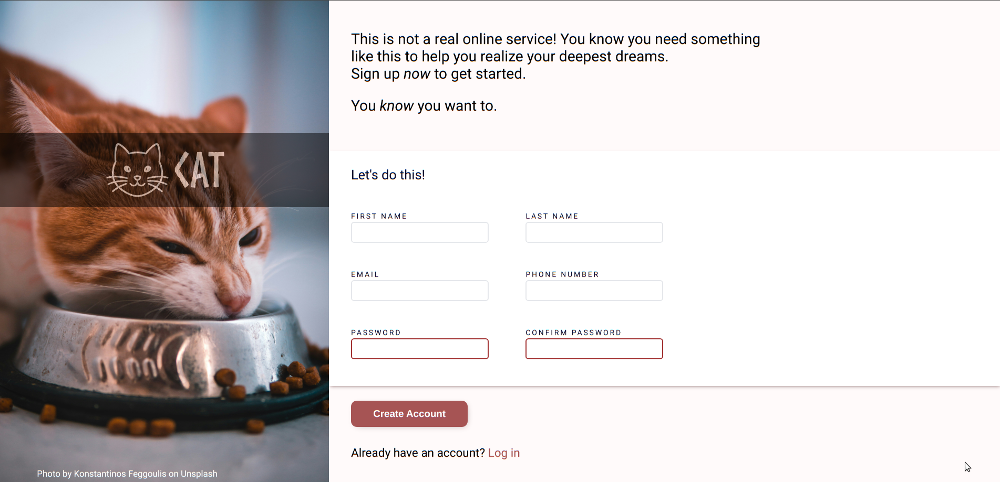

# Sign-Up Form

A sign-up form project built as part of [The Odin Project](https://www.theodinproject.com/) curriculum.  
The goal was to practice building accessible and styled forms using HTML & CSS.

---

## 📸 Preview

---

## ✨ Features / What I Learned
- Implemented **CSS pseudo-classes** (`:focus`, `:invalid`) to style form inputs and improve user experience  
- Applied a **descendant selector** for styling anchor tags within the form  
- Used **CSS positioning** to overlay the logo on the photo  
- Practiced form structure and layout with semantic HTML & CSS  

---

## 🚀 Live Demo
[View Project Here](https://sameeksha-dalvi.github.io/odin-project-signup-form/) 

---

## 🛠️ Built With
- HTML5  
- CSS3  

---

## 📚 Acknowledgements

Cat Photo by <a href="https://unsplash.com/@kostasfeg?utm_content=creditCopyText&utm_medium=referral&utm_source=unsplash">Konstantinos Feggoulis</a> on <a href="https://unsplash.com/photos/cat-eating-cat-food-in-pet-bowl-q9HWfccm4-0?utm_content=creditCopyText&utm_medium=referral&utm_source=unsplash">Unsplash</a>
      